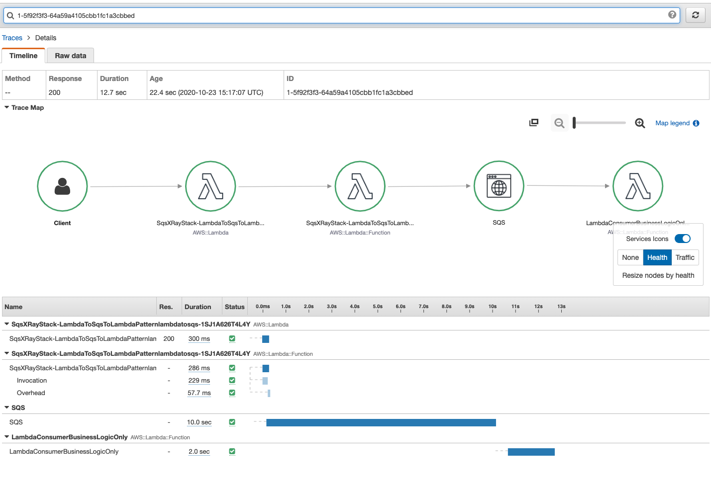

# X_Ray in case of Lambda => SQS => Lambda

CDK app based on https://docs.aws.amazon.com/solutions/latest/constructs/aws-lambda-sqs-lambda.html solution construct showing a workaround https://github.com/aws/aws-xray-sdk-node/issues/208 issue.

To get 


## Deploy

1. build and deploy the app

```
cdk bootstrap
npm install
npm run build && npm run cdk synth  && npm run cdk deploy 
```

1. disable X-Ray manually for consumer lambda (the one finishing by 'sqltolambda')

1. send a test event (the content of it does not matter) from producer lambda

1. check service lens map or xray
